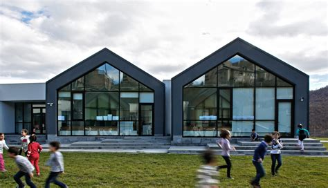

<!-- =====================================================
     PROFILE HERO
     ===================================================== -->

    

        

            ABOUT ME
        

        <h1>
            Ալեքս 
            Աղաջանյան
        </h1>

        

            Fab School · Digital Maker · Learner
        

        

            Բարի գալուստ իմ անձնական էջ։
            Այստեղ կարող եք մի փոքր ավելի լավ ճանաչել ինձ,
            իմ հետաքրքրությունները և այն ճանապարհը,
            որով անցնում եմ Fab School-ում։
        

        

            
                FAB SCHOOL
            

            
                DESIGN
            

            
                TECHNOLOGY
            

            
                CREATIVITY
            

        

    

    

        

        

        

            

        

        

            ALEKS · 2026
        

        

            CREATIVE MIND
        

    

<!-- =====================================================
     STORY
     ===================================================== -->

    

        MY STORY
    

    

        Մի փոքր իմ մասին
    

    

        

            

                Ես սիրում եմ սովորել նոր բաներ,
                փորձարկել տարբեր գաղափարներ և
                ստեղծել այնպիսի նախագծեր,
                որոնք միավորում են տեխնոլոգիան
                և ստեղծագործական մտածողությունը։
            

            

                Fab School-ը ինձ համար մի վայր է,
                որտեղ կարելի է ոչ միայն սովորել,
                այլ նաև փորձել, սխալվել, նորից փորձել
                և վերջում ստեղծել ինչ-որ իրական բան։
            

            

                Այս կայքում ես հավաքում եմ իմ աշխատանքի
                ընթացքը, որպեսզի ժամանակի ընթացքում
                կարողանամ տեսնել, թե ինչպես եմ զարգացել։
            

        

        

            

                

                    ✦
                

                

                    <strong>
                        Փորձել
                    </strong>

                    
                        Նոր գաղափարներ և տարբեր լուծումներ։
                    

                

            

            

                

                    ◇
                

                

                    <strong>
                        Ստեղծել
                    </strong>

                    
                        Գաղափարները դարձնել իրական նախագծեր։
                    

                

            

            

                

                    ↗
                

                

                    <strong>
                        Զարգանալ
                    </strong>

                    
                        Ամեն նոր աշխատանքից սովորել։
                    

                

            

        

    

<!-- =====================================================
     SKILLS
     ===================================================== -->

    

        WHAT I LIKE
    

    

        Ինձ հետաքրքրում են
    

    

        

            

                01 · DESIGN
            

            <h3>
                Դիզայն
            </h3>

            

                Վիզուալ գաղափարներ, ինտերֆեյսներ
                և հետաքրքիր ձևավորումներ։
            

        

        

            

                02 · TECH
            

            <h3>
                Տեխնոլոգիա
            </h3>

            

                Նոր գործիքներ, կոդ, թվային
                արտադրություն և փորձարկումներ։
            

        

        

            

                03 · BUILD
            

            <h3>
                Ստեղծել
            </h3>

            

                Գաղափարները վերածել ֆիզիկական
                կամ թվային նախագծերի։
            

        

    

<!-- =====================================================
     TIMELINE
     ===================================================== -->

    

        MY PATH
    

    

        Իմ ճանապարհը
    

    

        

            

                START
            

            <h3>
                Սկսեցի ուսումնասիրել
            </h3>

            

                Նոր գաղափարներ, գործիքներ և
                ստեղծագործական տեխնոլոգիաներ։
            

        

        

            

                FAB SCHOOL
            

            <h3>
                Սկսվեց Fab School ճանապարհորդությունը
            </h3>

            

                Շաբաթ առ շաբաթ աշխատում եմ,
                փաստագրում և սովորում։
            

        

        

            

                NEXT
            

            <h3>
                Նոր նախագծեր
            </h3>

            

                Հաջորդ քայլը նոր գաղափարներն են,
                նոր փորձերը և ավելի մեծ նախագծերը։
            

        

    

<!-- =====================================================
     FINAL MESSAGE
     ===================================================== -->

    <h2>
        Սա դեռ սկիզբն է։
    </h2>

    

        Իմ Fab School ճանապարհորդությունը շարունակվում է։
        Յուրաքանչյուր նոր նախագիծ այս պատմության ևս մեկ մասն է։
    

