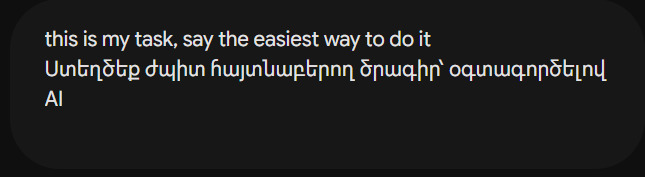

<!DOCTYPE html>
<html lang="hy" class="dark scroll-smooth">
<head>
    <meta charset="UTF-8">
    <meta name="viewport" content="width=device-width, initial-scale=1.0">
    <title>Week 1 #2 - VS Code, AI Research & OpenCV Documentation</title>
    <!-- Tailwind CSS CDN -->
    
    
    <!-- Google Fonts -->
    <link rel="preconnect" href="https://fonts.googleapis.com">
    <link rel="preconnect" href="https://fonts.gstatic.com" crossorigin>
    <link href="https://fonts.googleapis.com/css2?family=Fira+Code:wght@400;500;600&family=Inter:wght@300;400;500;600;700&family=Noto+Sans+Armenian:wght@300;400;500;600;700&display=swap" rel="stylesheet">
    <!-- Lucide Icons -->
    
    
</head>
<body class="min-h-screen text-slate-200 antialiased selection:bg-brand-500 selection:text-white">

    <!-- Top Navigation Header -->
    <header class="sticky top-0 z-50 glass-panel border-b border-slate-800/80 px-4 lg:px-8 py-3 transition-all duration-300">
        

            

                

                    <i data-lucide="code-2" class="w-6 h-6"></i>
                

                

                    Dev Docs
                    <h1 class="text-sm md:text-base font-bold text-white leading-tight">Week 1 #2 &bull; VS Code & AI Research</h1>
                

            

            <!-- Header Actions -->
            

                
                     Complete
                
                <button id="themeToggle" class="p-2.5 rounded-xl glass-panel text-slate-400 hover:text-white hover:bg-slate-800 transition">
                    <i data-lucide="sun" class="w-4 h-4 hidden dark:block"></i>
                    <i data-lucide="moon" class="w-4 h-4 block dark:hidden"></i>
                </button>
            

        

    </header>

    

        
        <!-- Navigation Sidebar (Desktop Floating TOC) -->
        <aside class="lg:w-64 flex-shrink-0">
            

                

                    <h2 class="text-xs font-bold text-slate-400 uppercase tracking-wider mb-3 px-2">Բովանդակություն</h2>
                    <nav class="space-y-1 text-sm font-medium" id="toc-nav">
                        <a href="#overview" class="flex items-center gap-2 px-3 py-2 rounded-xl text-brand-400 bg-brand-500/10 border border-brand-500/20 transition">
                            <i data-lucide="layout" class="w-4 h-4"></i>
                            Ակնարկ
                        </a>
                        <a href="#coding-ai" class="flex items-center gap-2 px-3 py-2 rounded-xl text-slate-400 hover:text-slate-200 hover:bg-slate-800/50 transition">
                            <i data-lucide="cpu" class="w-4 h-4"></i>
                            1. Ծրագրավորող AI
                        </a>
                        <a href="#explaining-ai" class="flex items-center gap-2 px-3 py-2 rounded-xl text-slate-400 hover:text-slate-200 hover:bg-slate-800/50 transition">
                            <i data-lucide="message-square" class="w-4 h-4"></i>
                            2. Բացատրող AI
                        </a>
                        <a href="#documentation" class="flex items-center gap-2 px-3 py-2 rounded-xl text-slate-400 hover:text-slate-200 hover:bg-slate-800/50 transition">
                            <i data-lucide="file-text" class="w-4 h-4"></i>
                            3. Փաստաթղթավորում
                        </a>
                        <a href="#workflow" class="flex items-center gap-2 px-3 py-2 rounded-xl text-slate-400 hover:text-slate-200 hover:bg-slate-800/50 transition">
                            <i data-lucide="terminal" class="w-4 h-4"></i>
                            4. Աշխատանքի Ընթացք
                        </a>
                    </nav>
                

                <!-- Meta Info Card -->
                

                    
Միջավայրի տվյալներ

                    

                        <i data-lucide="folder" class="w-4 h-4 text-brand-400"></i>
                        VS Code + Python 3.13
                    

                    

                        <i data-lucide="box" class="w-4 h-4 text-indigo-400"></i>
                        OpenCV Computer Vision
                    

                

            

        </aside>

        <!-- Main Content Area -->
        <main class="flex-1 space-y-12">

            <!-- Hero Section / Title -->
            <section id="overview" class="glass-panel rounded-3xl p-6 md:p-10 relative overflow-hidden gradient-border">
                

                

                    

                        <i data-lucide="sparkles" class="w-3.5 h-3.5"></i> Week 1 #2 Հետազոտություն
                    

                    <h1 class="text-3xl md:text-4xl lg:text-5xl font-extrabold tracking-tight text-white">
                        AI Գործիքների Հետազոտություն & Python Real-Time Detection
                    </h1>
                    

                        VS Code աշխատանքային միջավայրում AI օգնականների համեմատական վերլուծություն (Claude, DeepSeek, ChatGPT, Copilot, Gemini) և OpenCV գրադարանով իրական ժամանակում դեմքի ու ժպիտի ճանաչման ծրագրի ստեղծում:
                    

                    
                    

                        

                            <i data-lucide="check-circle" class="w-4 h-4 text-brand-400"></i>
                            VS Code Integrated Environment
                        

                        

                            <i data-lucide="check-circle" class="w-4 h-4 text-brand-400"></i>
                            Python 3.13 & Haarcascades
                        

                        

                            <i data-lucide="check-circle" class="w-4 h-4 text-brand-400"></i>
                            Real-Time Face/Smile Detection
                        

                    

                

            </section>

            <!-- Research Section 1: AI Tools for Coding -->
            <section id="coding-ai" class="space-y-6">
                

                    

                        Research Part 1
                        <h2 class="text-2xl font-bold text-white flex items-center gap-2">
                            <i data-lucide="code" class="w-6 h-6 text-brand-500"></i>
                            Ո՞ր AI գործիքն է ավելի լավ ծրագրավորում
                        </h2>
                    

                    

                        <button onclick="filterAI('all')" class="ai-filter-btn active px-3 py-1.5 rounded-lg bg-brand-600 text-white font-medium transition">Բոլորը</button>
                        <button onclick="filterAI('top')" class="ai-filter-btn px-3 py-1.5 rounded-lg text-slate-400 hover:text-white transition">Լավագույնները (&gt;9)</button>
                    

                

                <!-- Prompt Image / Architecture Display Card -->
                

                    

                        <i data-lucide="image" class="w-4 h-4 text-indigo-400"></i> Ai-prompt.jpg
                        Prompt Frame
                    

                    

                        <i data-lucide=\'terminal\' class=\'w-10 h-10 mx-auto text-brand-400 mb-2\'></i>
AI Prompt Configuration & Workflow Screenshot

../images/week02/Ai-prompt.jpg

';"
                        >
                    

                    

                        VS Code-ում Python կոդ գրելու և թեստավորելու ընթացքում օգտագործված պրոմպտի կառուցվածքը:
                    

                

                <!-- AI Models Grid -->
                

                    
                    <!-- Claude Card -->
                    

                        

                            <i data-lucide="trophy" class="w-3 h-3"></i> Top Choice
                        

                        

                            

                                <h3 class="text-lg font-bold text-white flex items-center gap-2">
                                    Claude (Anthropic)
                                </h3>
                                
Ամենամաքուր ու կառուցվածքային կոդը

                            

                            

                                9.5/10
                            

                        

                        

                            

                        

                        

                            Տալիս է ամենամաքուր, կառուցվածքային առումով գրագետ ու անմիջապես աշխատող կոդը: Հատկապես ուժեղ է սխալների ապահովագրման մեջ (exception handling). ճիշտ ասեց VS Code-ի terminal-ում XML ֆայլերի (haarcascades) բացակայության խնդիրը և ավելացրեց դրանք ավտոմատ urllib-ով ներբեռնելու տրամաբանությունը:
                        

                    

                    <!-- DeepSeek Card -->
                    

                        

                            Highly Optimal
                        

                        

                            

                                <h3 class="text-lg font-bold text-white flex items-center gap-2">
                                    DeepSeek
                                </h3>
                                
Ճշգրիտ & Оպտիմալացված

                            

                            

                                9/10
                            

                        

                        

                            

                        

                        

                            Ծրագրավորման խնդիրներ լուծելու մեջ զարմանալիորեն ուժեղ է: Տալիս է շատ ճշգրիտ, օպտիմալացված կոդ: VS Code-ի ներսում integrated terminal-ով աշխատեցնելու համար առաջարկեց ամենաօպտիմալ գրադարանային կախվածությունները (<code class="bg-slate-800 text-indigo-300 px-1.5 py-0.5 rounded text-xs">opencv-contrib-python</code>):
                        

                    

                    <!-- ChatGPT Card -->
                    

                        

                            

                                <h3 class="text-lg font-bold text-white flex items-center gap-2">
                                    ChatGPT (OpenAI)
                                </h3>
                                
Արագ, բայց պահանջում է ուղղում

                            

                            

                                8.5/10
                            

                        

                        

                            

                        

                        

                            Շատ արագ է գրում, կոդը հիմնականում աշխատող է, բայց երբեմն օգտագործում է հնացած մեթոդներ (օրինակ՝ <code class="bg-slate-800 text-amber-300 px-1.5 py-0.5 rounded text-xs">cv2.data.haarcascades</code>-ի ուղիղ կանչը, որը Windows-ի VS Code terminal-ում path-ի սխալ էր տալիս):
                        

                    

                    <!-- Copilot & Gemini Card -->
                    

                        

                            

                                <h3 class="text-lg font-bold text-white flex items-center gap-2">
                                    Copilot & Gemini
                                </h3>
                                
Օժանդակ հուշումների համար

                            

                            

                                7.5/10
                            

                        

                        

                            

                        

                        

                            Copilot-ը հարմար է VS Code-ի ներսում հուշումների համար, բայց զրոյից ամբողջական ու անսխալ ծրագիր ստեղծելու համար երկուսն էլ պահանջեցին լրացուցիչ ուղղումներ:
                        

                    

                

            </section>

            <!-- Research Section 2: AI Explanations -->
            <section id="explaining-ai" class="space-y-6">
                

                    Research Part 2
                    <h2 class="text-2xl font-bold text-white flex items-center gap-2">
                        <i data-lucide="book-open" class="w-6 h-6 text-brand-500"></i>
                        Ո՞ր AI գործիքն է ավելի լավ բացատրում
                    </h2>
                

                <!-- Interactive Tab View for Explanation Comparison -->
                

                    

                        

                            

                                <i data-lucide="award" class="w-5 h-5"></i>
                            

                            

                                <h3 class="text-base font-bold text-white">Լավագույնները՝ ChatGPT և Claude</h3>
                                
Տեսական հասկացությունների և քայլերի մանրամասն պարզաբանում

                            

                        

                    

                    

                        
                        <!-- ChatGPT Explanation Card -->
                        

                            

                                ChatGPT
                                №1 Explainer
                            

                            

                                Անկասկած լավագույնն է «ինչու է սա այսպես աշխատում» հարցերին պատասխանելիս: Բարդ հասկացությունները (օրինակ՝ OpenCV-ի <code class="text-amber-300">scaleFactor</code>-ը կամ <code class="text-amber-300">minNeighbors</code>-ը) բացատրում է շատ պարզ:
                            

                        

                        <!-- Claude Explanation Card -->
                        

                            

                                Claude
                                Structured
                            

                            

                                Շատ լավ է բացատրում քայլերի հաջորդականությունը: Կոդի յուրաքանչյուր տողի տակ տալիս է մանրամասն comment-ներ, ինչը VS Code-ում կոդը կարդալու և տրամաբանությունը սովորելու համար հրաշալի է:
                            

                        

                        <!-- Gemini & Copilot Card -->
                        

                            

                                Gemini & Copilot
                                Concise
                            

                            

                                Տալիս են կարճ, չոր տեսական պատասխաններ: Նախատեսված են արագ ակնարկի, այլ ոչ խորը ուսուցման համար:
                            

                        

                        <!-- DeepSeek Explanation Card -->
                        

                            

                                DeepSeek
                                Advanced
                            

                            

                                Բացատրությունները չափազանց տեխնիկական են. ավելի շատ նախատեսված են փորձառու ծրագրավորողների, այլ ոչ թե սկսնակների համար:
                            

                        

                    

                

            </section>

            <!-- Section 3: Documentation -->
            <section id="documentation" class="space-y-6">
                

                    Project Documentation
                    <h2 class="text-2xl font-bold text-white flex items-center gap-2">
                        <i data-lucide="folder-git2" class="w-6 h-6 text-brand-500"></i>
                        3. Ծրագրի փաստաթղթավորում
                    </h2>
                

                <!-- Goal Banner -->
                

                    
Նպատակը

                    

                        <strong class="text-white">Visual Studio Code (VS Code)</strong> աշխատանքային միջավայրում ստեղծել Python ծրագիր, որը համակարգչի տեսախցիկից իրական ժամանակում (real-time) կճանաչի մարդու դեմքը և կհայտնաբերի ժպիտը:
                    

                

                <!-- Tech Stack Cards Grid -->
                

                    
                    

                        

                            <i data-lucide="laptop" class="w-4 h-4"></i> IDE
                        

                        
VS Code

                        
Visual Studio Code + Python Extension

                    

                    

                        

                            <i data-lucide="terminal" class="w-4 h-4"></i> Terminal
                        

                        
PowerShell

                        
VS Code Integrated Terminal

                    

                    

                        

                            <i data-lucide="layers" class="w-4 h-4"></i> Environment
                        

                        
Python 3.13

                        
py launcher configured

                    

                    

                        

                            <i data-lucide="package" class="w-4 h-4"></i> Libraries
                        

                        
OpenCV, urllib, os

                        
opencv-contrib-python

                    

                

            </section>

            <!-- Step-by-Step Workflow Section -->
            <section id="workflow" class="space-y-6">
                

                    Execution Flow
                    <h2 class="text-2xl font-bold text-white flex items-center gap-2">
                        <i data-lucide="play-circle" class="w-6 h-6 text-brand-500"></i>
                        Աշխատանքի Ընթացքը VS Code-ում
                    </h2>
                

                <!-- Step 1: Environment Setup -->
                

                    

                        1
                        

                            <h3 class="text-lg font-bold text-white">Քայլ 1․ Միջավայրի պատրաստում</h3>
                            
Գրադարանների տեղադրում VS Code Integrated Terminal-ում (<kbd class="px-1.5 py-0.5 rounded bg-slate-800 text-slate-300 font-mono">Ctrl + ~</kbd>)

                        

                    

                    <!-- VS Code Terminal Simulation Component -->
                    

                        

                            

                                
                                
                                
                                PowerShell - VS Code Terminal
                            

                            <button onclick="copyTerminalCode()" class="text-slate-400 hover:text-white flex items-center gap-1 text-[11px] transition">
                                <i data-lucide="copy" class="w-3.5 h-3.5"></i> Copy
                            </button>
                        

                        

                            

                                PS C:\Users\Dev\Week2&gt;
                                py -m pip install opencv-contrib-python
                            

                            

                                Collecting opencv-contrib-python 
                                Downloading opencv_contrib_python-4.10.0-cp313-win_amd64.whl (45.2 MB) 
                                Successfully installed opencv-contrib-python-4.10.0
                            

                        

                    

                

                <!-- Step 2: Code File & Logic Breakdown -->
                

                    

                        2
                        

                            <h3 class="text-lg font-bold text-white">Քայլ 2․ Ֆայլի ստեղծում և ալգորիթմի տեղադրում</h3>
                            
VS Code-ում ստեղծվեց <code class="text-indigo-400 font-mono">smile_detector.py</code> ֆայլը

                        

                    

                    <!-- Interactive Algorithm Cards Grid -->
                    

                        
                        <!-- Logic Item 1 -->
                        

                            

                                <i data-lucide="download-cloud" class="w-4 h-4"></i>
                                1. Մոդելների ավտոմատ ներբեռնում
                            

                            

                                Որպեսզի VS Code-ը կախված չլինի համակարգչի տեղական PATH-երից, ծրագիրը ստուգում է <code class="text-brand-300 font-mono">haarcascades</code> XML ֆայլերի առկայությունը թղթապանակում: Եթե չկան, urllib-ով ավտոմատ քաշում է GitHub-ից:
                            

                        

                        <!-- Logic Item 2 -->
                        

                            

                                <i data-lucide="camera" class="w-4 h-4"></i>
                                2. Տեսախցիկի ակտիվացում
                            

                            

                                Կանչվում է <code class="text-indigo-300 font-mono">cv2.VideoCapture(0)</code> ֆունկցիան, որը միացնում է տեսախցիկը և սկսում կարդալ կանոնավոր կադրեր real-time ռեժիմով:
                            

                        

                        <!-- Logic Item 3 -->
                        

                            

                                <i data-lucide="eye" class="w-4 h-4"></i>
                                3. Կադրի մշակում (Grayscale)
                            

                            

                                Գունավոր պատկերը փոխարկվում է սև-սպիտակի (<code class="text-emerald-300 font-mono">cv2.COLOR_BGR2GRAY</code>), որպեսզի պատկերի մշակումը VS Code-ում աշխատի առանց lag-երի:
                            

                        

                        <!-- Logic Item 4 -->
                        

                            

                                <i data-lucide="smile" class="w-4 h-4"></i>
                                4. Դեմքի և Ժպիտի Հայտնաբերում (ROI)
                            

                            

                                Նախ հայտնաբերվում է դեմքը (կապույտ ուղղանկյուն), այնուհետև դեմքի հատվածում (Region of Interest) փնտրվում է ժպիտը:
                            

                        

                    

                    <!-- Key Optimization Callout Box -->
                    

                        

                            <i data-lucide="lightbulb" class="w-5 h-5"></i>
                        

                        

                            <h4 class="text-sm font-bold text-amber-300">Կարևոր օպտիմալացում (Week 2 Debugging)</h4>
                            

                                Ժպիտի ճանաչման զգայունությունը կարգավորվեց <code class="bg-amber-950/80 text-amber-300 px-1.5 py-0.5 rounded font-mono">minNeighbors=5</code> պարամետրով, որպեսզի ծրագիրն ավելի հեշտ նկատի ժպիտը և դրա շուրջ գծի կանաչ ուղղանկյուն:
                            

                        

                    

                

            </section>

        </main>
    

    <!-- Footer -->
    <footer class="mt-20 border-t border-slate-800 py-8 text-center text-xs text-slate-500">
        

            

                &copy; 2026 VS Code & Python AI Research Docs. All rights reserved.
            

            

                Python 3.13
                &bull;
                OpenCV Real-Time
                &bull;
                VS Code Workspaces
            

        

    </footer>

    <!-- Scripts -->
    
</body>
</html>